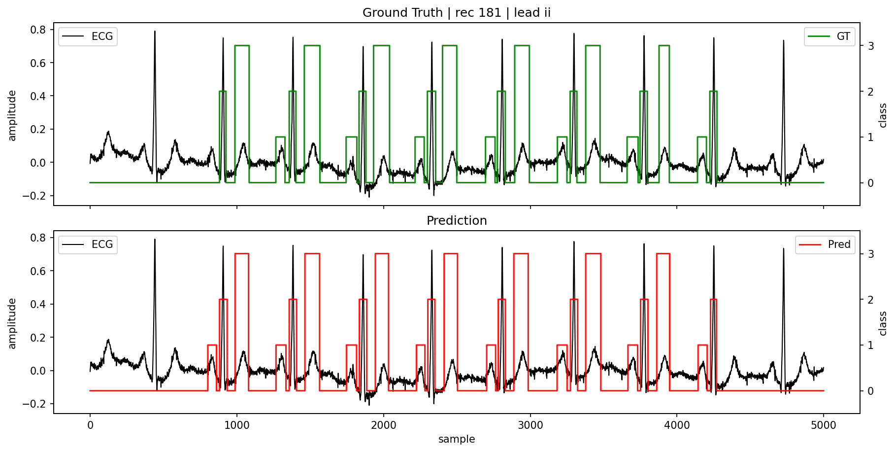
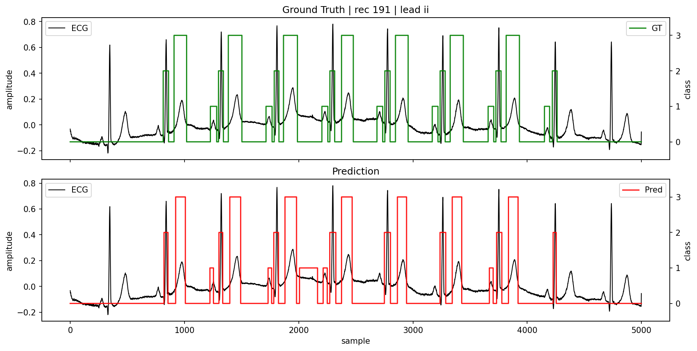
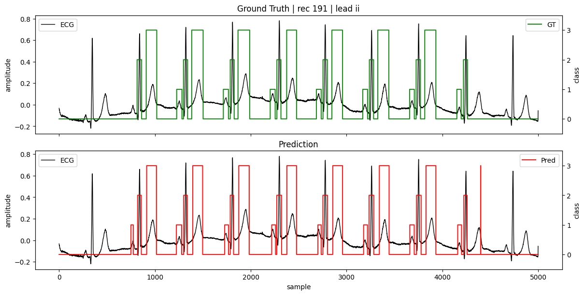

# Supervised-CCT-ECG-Segmentation

This repository contains the implementation of my MSc thesis: "**Supervised Criss-Cross Transformer for ECG Waveform Segmentation**”, submitted to the **University of Glasgow** on **5th September 2025**.
The project investigates deep learning approaches for ECG waveform segmentation, focusing on detection of P wave, QRS complex, and T wave boundaries using both baseline models and a Transformer-based architecture adapted from the Criss-Cross Attention mechanism.


## **Project Overview**
Accurate ECG segmentation is essential for cardiac diagnosis, yet remains challenging due to noise, variable morphology, and low-amplitude P waves.  
This project evaluates three deep learning approaches:
### **1. Baseline Models**
- **1D U-Net**
- **CNN + BiLSTM**

### **2. Proposed Model**
- **Supervised Criss-Cross Transformer (CCT)**  
  A transformer-based architecture featuring:
  - **1D patch embedding**
  - **Criss-Cross temporal & spatial attention**
  - **Transformer encoder blocks with reduced complexity**
  - **Linear upsampling for dense prediction**

## Dataset
### **Lobachevsky University Database (LUDB)**

- **200 subjects**
- **12-lead ECG, 10 seconds each**
- **500 Hz sampling rate**
- **Expert-labeled onset/offset of P, QRS, T**
- **~58k annotated waves (more than QTDB)**
- LUDB dataset downloaded from **https://physionet.org/content/ludb/1.0.1**

### **Extensive preprocessing includes:**
- Fixing malformed or misaligned annotations  
- Handling missing offsets/onsets  
- Validating triplet structure `(wave)`  
- Manual correction of corrupted labels (Records 8 & 116)

## Methodology
### **Preprocessing**
- Per-lead annotation validation  
- Conversion to sample-wise labels (classes: 0–3)  
- Patient-wise splits (no leakage)  
- Training on annotated 1–9 second interval  

### **Model Training**
- **Loss:** Categorical Cross-Entropy  
- **Optimizers:**
  - Adam (baselines)
  - AdamW (CCT)
- **50 epochs**, batch size **8**  
- **10-fold cross-validation** (patient-level)

## Results
### **F1 Scores (Mean over 10 folds)**

| Model            | P         | QRS       | T          |
|------------------|-----------|-----------|-------------|
| **U-Net (1-lead)**       | ~0.86     | ~0.97     | ~0.89      |
| **U-Net (12-lead)**      | ↓ major drop (≤0.4) | ↓ | ↓ |
| **CNN+BiLSTM (1-lead)** | ~0.80     | ~0.96     | ~0.82      |
| **CNN+BiLSTM (12-lead)**| **0.88**  | **0.99**  | **0.93**   |
| **CCT (12-lead)**        | 0.82–0.83 | **0.98+** | 0.89–0.90  |

### **Key Findings**
- **U-Net works very well for single-lead but fails on multi-lead inputs.**
- **CNN+BiLSTM generalises best overall**, especially in multi-lead mode.
- **CCT performs competitively** and is strongest on **QRS boundaries**.
- **Lead ordering matters** — shuffling drops P-wave F1 from **0.883 → 0.505**.

## 🖼️ Visual Examples
Qualitative segmentation plots are included in the thesis, comparing:
- Ground truth  
- Predictions for **U-Net**, **CNN+BiLSTM**, and **CCT**
For example patient: **Record 181, Lead II**



### 🔀 Effect of Lead Ordering
An additional visualization highlights how the ordering of ECG leads affects model performance:
- The CCT model was trained using the **physiological lead index order** (I, II, III, aVR, …, V6).
- During inference, the same signals were shuffled alphabetically by channel name.
- **Result:**  
  - P-wave F1 dropped from **0.883 → 0.505**  
  - QRS and T boundaries remained stable  
  - Visual plots showed fragmented or missing P-wave predictions
This demonstrates that the CCT model learns **both temporal and spatial inter-lead relationships**, and disrupting the lead structure degrades segmentation quality.

<p align="center">
  
  
</p>
<p align="center"><b>Figure:</b> Left – Shuffled Lead Order. Right – Physiological Lead Index Order.</p>


## Repository Structure
```
Supervised-CCT-ECG-Segmentation/
├── dataCache/
├── figures/
│ ├── *.png
│ └── *.drawio
├── rawData/
│ └── lobachevsky-university/
├── results/
├── .gitattributes
├── Notebook.ipynb
├── configs.yaml
├── data.py
├── dataset.py
├── metrics.py
├── models.py
├── tests.py
├── utils.py
└── README.md
```

## 🚀 How to Run

### 1. Clone the repo
```bash
git clone https://github.com/gaurav-S8/Supervised-CCT-ECG-Segmentation.git
cd Supervised-CCT-ECG-Segmentation
```

### 2. Install dependencies
```bash
pip install numpy scipy matplotlib torch scikit-learn wfdb
```

### 3. Open the main notebook
```bash
jupyter notebook Notebook.ipynb
```

## Thesis Document
The full dissertation PDF is included as: **MSc_project_3043108s.pdf**

## Future Work
- Scale training to larger ECG datasets (PTB-XL, etc.)
- Pretraining (self-supervised) for transformer models
- Hybrid CNN + Transformer architectures
- Deployment for real-time ECG analysis

Course / Acknowledgment

## Citation
If you use this work, please cite:
```
Gaurav Singariya,
"Supervised Criss-Cross Transformer for ECG Waveform Segmentation",
MSc Dissertation, University of Glasgow, 2025.
```
